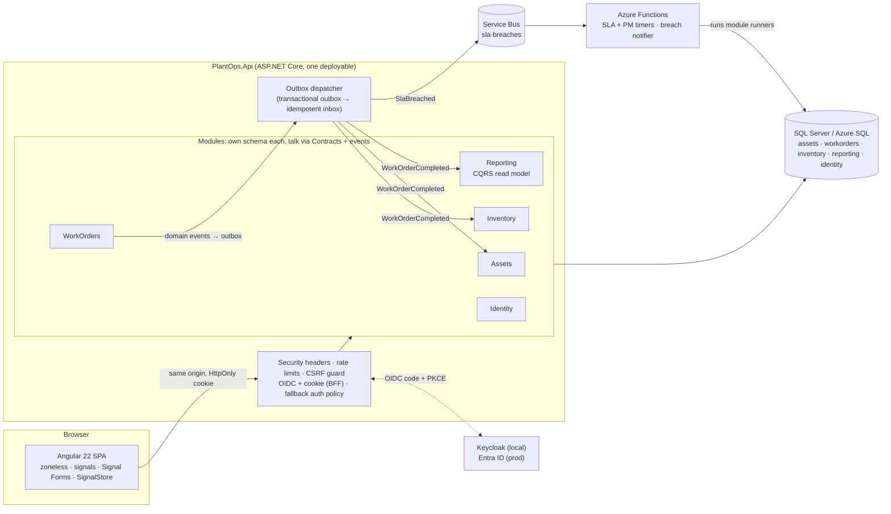
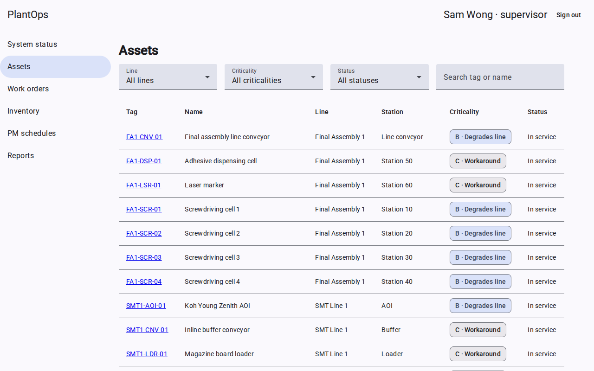
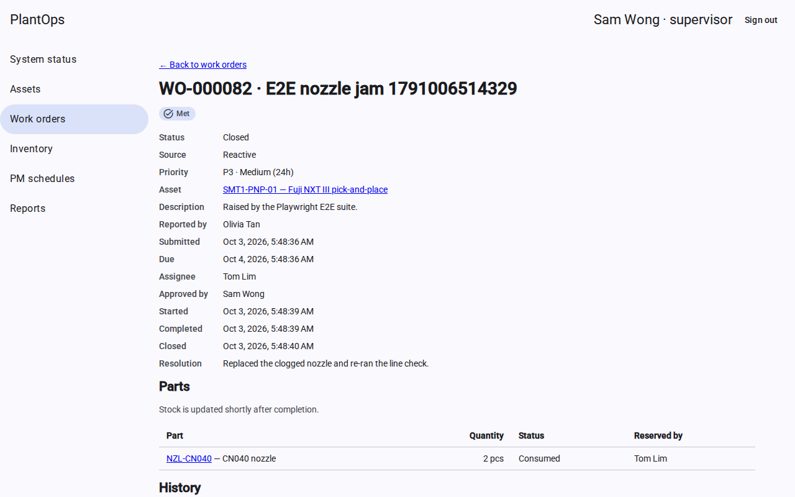
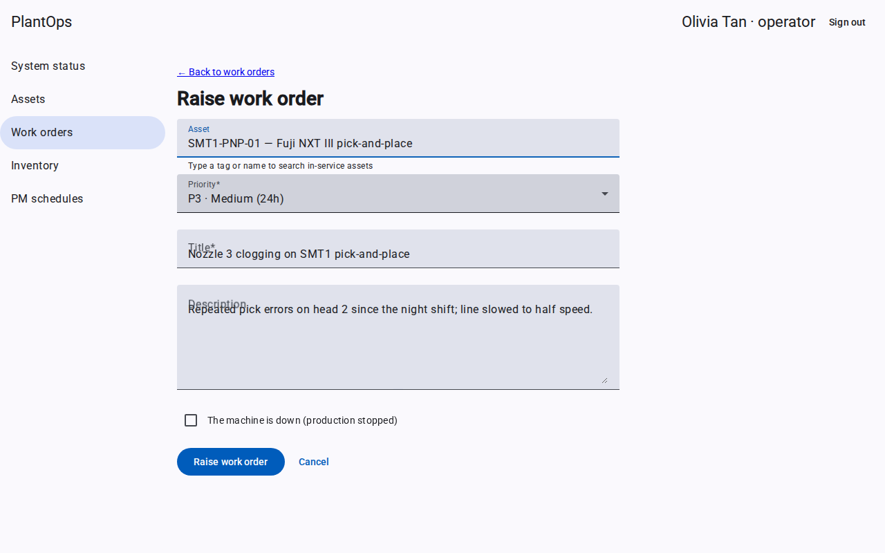
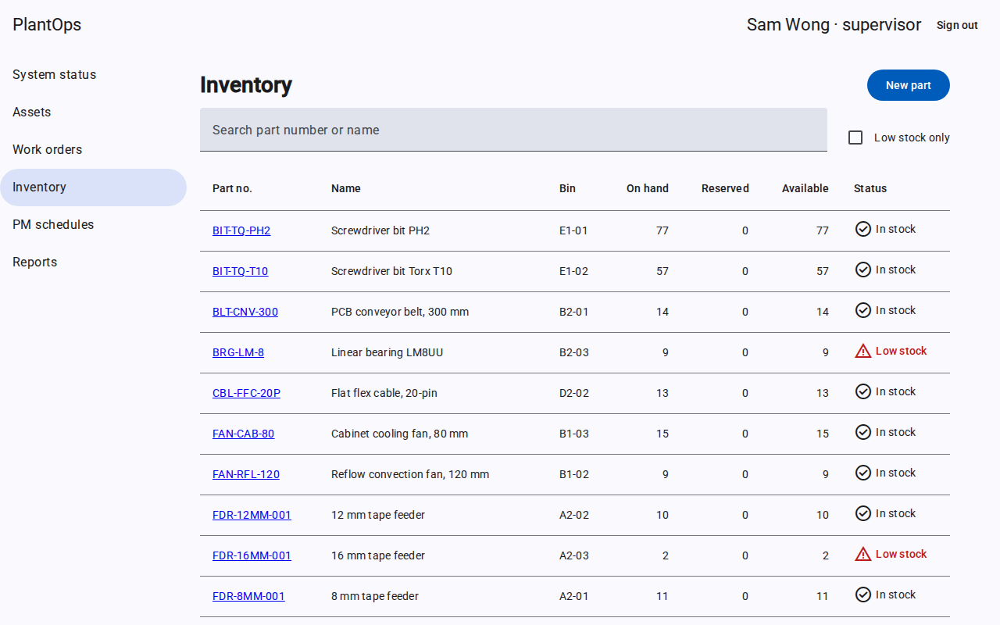
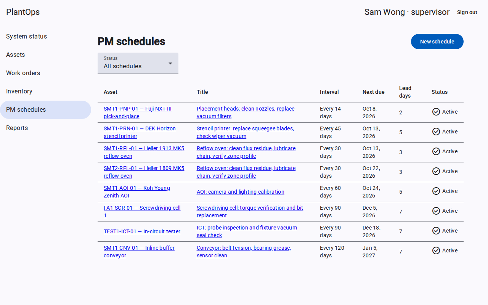
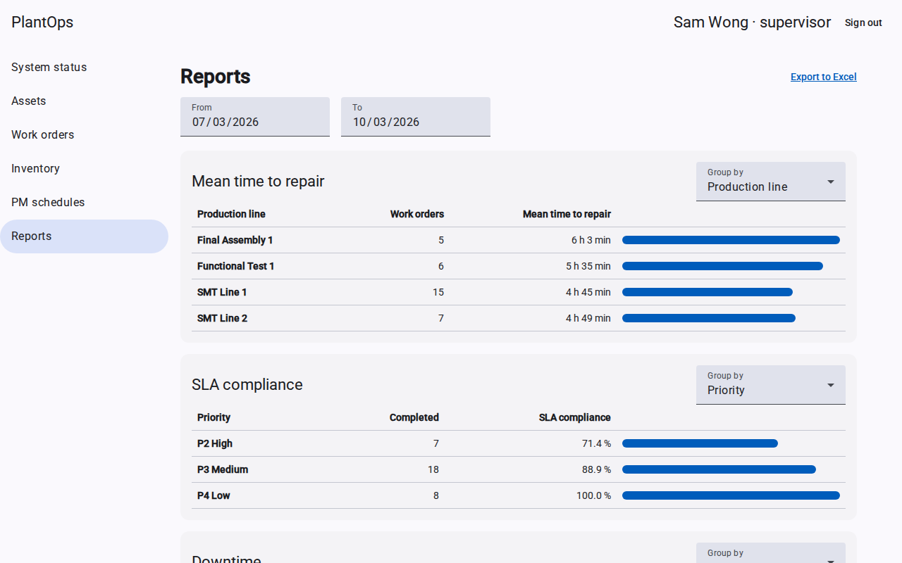

# PlantOps

[](https://github.com/vcchuen/plantops/actions/workflows/ci.yml)
[](https://github.com/vcchuen/plantops/actions/workflows/e2e.yml)

**Maintenance and asset management for a (fictional) electronics factory in Penang.** Operators report broken machines, supervisors approve and assign, technicians repair against an SLA, spare parts are reserved and consumed, preventive maintenance raises its own work orders, and managers get MTTR, SLA-compliance and downtime reports in Excel.

Built as a **.NET 9 modular monolith + Angular 22** portfolio project, with every decision written down (ADRs, a design doc per milestone) and every performance claim measured in CI.


## The problem
A factory loses money every minute a pick-and-place machine is down. The process around a repair has to be **fast, accountable and auditable**:
- who reported it;
- who approved it;
- whether it was fixed within the SLA for its priority;
- which spare parts went into it;
- whether preventive maintenance is happening at all.

Spreadsheets and chat messages can't answer those questions. PlantOps can.

## Architecture


**Key ideas, each with its ADR in [`docs/adr`](docs/adr/README.md):**
- **Modular monolith, not microservices.** Each module is an `internal` implementation plus a public Contracts project, owns its own schema, and is enforced by architecture tests. Extracting one later is mechanical.
- **DDD where it pays.** Aggregates guard invariants (the work order state machine, stock never negative), value objects make invalid states unrepresentable, and domain events feed an **atomic audit trail** and a **transactional outbox**.
- **Concurrency handled per use case.** Work orders refuse stale edits (ETag / If-Match → 412). Stock reservations retry automatically. Uniqueness and preventive-maintenance races are settled by database constraints.
- **CQRS only for reporting.** Completed work orders project into a read model. The covering index on it was **chosen from measured query plans** (894 → 48 logical reads).
- **BFF authentication.** The browser holds an HttpOnly cookie, never a token. Swapping Keycloak for Entra ID is configuration only ([guide](docs/guides/entra-id.md)).
- **OWASP Top 10:2025** mapped category by category to code and tests in [`docs/security/owasp-top-10.md`](docs/security/owasp-top-10.md).

## Screenshots
| | |
|---|---|
|  |  |
|  |  |
|  |  |

*Captured by Playwright in CI against the real stack (`docker compose`, Keycloak, SQL Server, demo seed).*

## Run it locally
You need Docker. One command starts SQL Server, Keycloak and the app, with realistic Penang demo data:
```bash
cp .env.example .env          # set the passwords
docker compose up --build
```
- **App:** <http://localhost:8080>
- **Keycloak admin:** <http://localhost:8081>
- **Users:** `olivia` (operator), `tom` (technician), `sam` (supervisor), `ada` (admin), all with password `Passw0rd!` (local only).
- **SQL Server image:** amd64 only, so it runs under emulation on Apple Silicon.
- **Optional Service Bus emulator:** `docker compose --profile messaging up`.

**Developing without Docker:**
```bash
dotnet test PlantOps.slnx                  # unit + host tests (SQL integration tests skip unless PLANTOPS_INTEGRATION_TESTS=1)
cd web && npm ci && npm start              # Angular dev server, proxies /api to http://localhost:5080
```

## Quality
| Layer | Tool | Where it runs |
|---|---|---|
| Domain unit tests | xUnit v3 | every push |
| Integration against real SQL Server (races, migrations, authorisation) | Testcontainers + WebApplicationFactory | every push (CI) |
| Angular components | Vitest, run in **two time zones** (date bugs are directional) | every push |
| End-to-end + accessibility | Playwright + axe, against `docker compose` with real Keycloak | every push (CI) |
| Performance | query plans, N+1 vs projection, BenchmarkDotNet | `perf.yml` (results in [study guide 07](docs/study/07-reporting-and-performance.md)) |
| Supply chain | vulnerable NuGet/npm gates, Dependabot, SHA-pinned actions | every push |

**Measured, not claimed** (perf runs 37091237887 and 37091441234):
- the reporting index cut logical reads by **94.6 %**;
- an N+1 page issues **102** SQL commands against **2** for the projection, **3.8–4.3× slower**;
- a compiled query was **not adopted**, because its difference was inside BenchmarkDotNet's error bars.

## Azure
The Bicep in [`deploy/azure`](deploy/azure/README.md) describes:
- App Service, Functions on Flex Consumption, Azure SQL (free offer);
- Service Bus Standard, Key Vault, and Application Insights via OpenTelemetry;
- managed identities everywhere;
- a manual GitHub Actions deploy with OIDC (no stored secrets).

It compiles in CI. **It has not been deployed**, so no real spend has been measured. List prices from the Azure Retail Prices API are in [`docs/azure-cost.md`](docs/azure-cost.md).

## Trade-offs I'd defend
- **.NET 9 (STS, support ends 2026-11-10)**, because of a tooling constraint on the dev machine. Upgrading is a TFM bump ([ADR-0003](docs/adr/0003-target-dotnet-9.md)).
- **A modular monolith scales as one unit.** That's the right trade for one team and one factory.
- **Eventual consistency between modules:** stock and reports update about 2 s after completion, and the UI says so.
- **`style-src 'unsafe-inline'`** in the CSP: Angular injects component styles; scripts stay strict.
- **JIT user directory:** a technician must have logged in once before they can be assigned.
- **Seeded audit rows** show "System" as the actor; the work orders themselves carry the historical people and times.

## What I'd do next
1. **Generate the TypeScript API client from OpenAPI.** Contract drift between the backend and the SPA happened twice; E2E caught it both times, but the compiler should.
2. **Deploy to Azure for a month** and replace list prices with Cost Management numbers; verify the items listed as "unverified until deploy".
3. **Event-driven follow-ups:** deactivate PM schedules when an asset is decommissioned, and keep a reporting projection of asset moves.
4. **Self-host fonts** and move to a nonce-based CSP for styles.
5. **Add tests** for outbox parking and for logout while the IdP is unreachable (the two gaps listed in the OWASP doc), plus a command-count guard on the work order list.
6. **Upgrade to .NET 10 LTS**, which also unlocks optional complex types for value objects.

## Repository guide
| Path | What |
|---|---|
| `src/Modules/*` | Assets, WorkOrders, Inventory, Reporting, Identity (+ Contracts) |
| `src/BuildingBlocks` | Shared kernel (domain), infrastructure (audit, outbox/inbox, factory clock) |
| `src/Host/PlantOps.Api` | Composition root: security, seeding, Azure hosting |
| `src/Functions` | Azure Functions host for timers and the Service Bus notifier |
| `web/` | Angular app; `web/e2e` Playwright suite |
| `perf/` | CI performance harness |
| `deploy/` | Keycloak realm, Service Bus emulator config, Azure Bicep |
| `docs/design` | One design doc per milestone (problem, options, decision) |
| `docs/adr` | Architecture decision records |
| `docs/study` | Study guides: concepts, code tours, interview Q&A, break-it labs |
